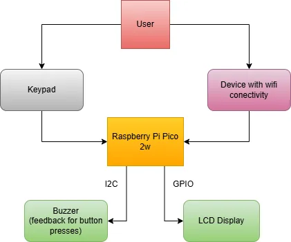
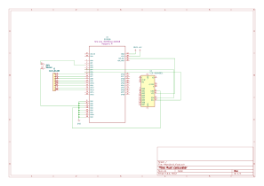

# Rust Calculator
A calculator that take numbers and opperations as inputs and outputs results

## Description

This project implements a calculator using a Raspberry Pi Pico 2w microcontroller running rust code.
It supports:

- **Basic arithmetic**: addition, subtraction, multiplication, division  
- **More advanced functions**: exponentiation, square roots, and (in future iterations) trigonometric operations  
- **Graphical interface**: an LCD display(with blue backlight) for on device feedback  
- **Audible feedback**: buzzer beeps confirm key presses

Input comes from a 4x4 matrix keypad and output is drawn via embedded-graphics primitives on the LCD and signaled through a buzzer.

## Architecture 

### Components

- **Raspberry Pi Pico 2w**: connected to everything and runs code, has wifi functionality
- **Keypad**: connect with GPIO pins
- **LCD display**: connect with GPIO pins and uses I2C
- **Buzzer**: connect with GPIO pins

## Hardware
- Raspberry Pi Pico 2W (RP2350): Main microcontroller handling system logic, display and wifi functionality  
- LCD 1602 I2C, blue backlight: 16x2 character display for UI and results  
- Keypad: user input for numbers and operations  
- 3V active buzzers: audio feedback for key presses  
- Breadboard & jumper wires for prototyping

### Schematics

